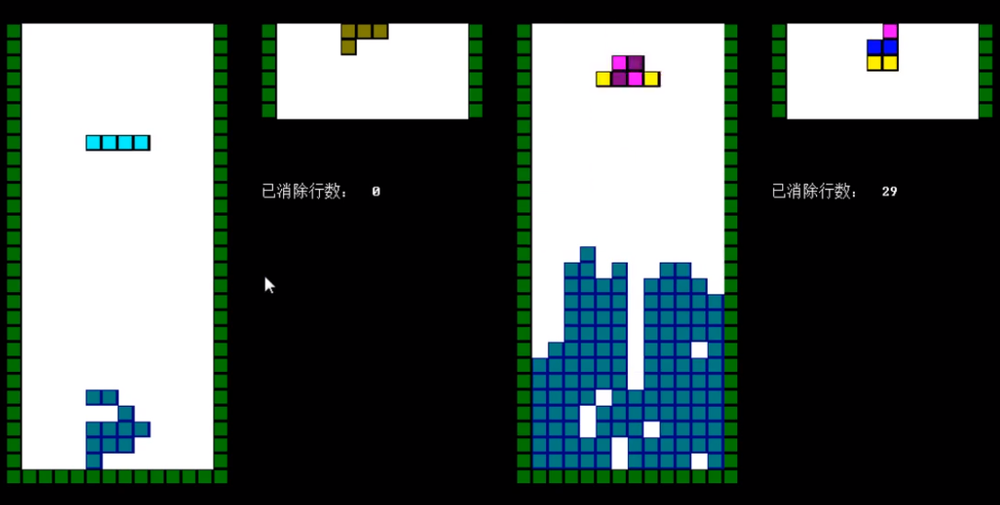

# Tetris

Tetris game with customizable tetrominoes, and a bot adversary (on the right side).

Video Demo: [Vimeo](https://vimeo.com/433939685)

Executable File Download: [Google Drive](https://drive.google.com/drive/folders/18C2yXwJ-W-4sQsBSxeIS-zAmI0r_kbQk?usp=sharing)

Features:
- Windows console programming
- Draw customized tetrominoes with mouse (2:03 in video)
- Customized tetrominoes are persistently stored in files
- The bot adversary can handle both traditional and customized tetrominoes
- The bot adversary's play speed can be tuned

---

# 俄罗斯方块

可自定义方块的俄罗斯方块，还有电脑人陪玩（屏幕右侧）。

演示视频：[BiliBili](https://www.bilibili.com/video/BV1rs411b7VG/)

可执行文件下载：[蓝奏云](https://wws.lanzous.com/iwrz1e8b32d)

特色：
- Windows控制台编程
- 通过鼠标绘图自定义方块（演示视频203处）
- 自定义方块信息被保存在硬盘文件中
- 电脑人能应对传统方块，也能应对自定义方块
- 电脑人速度可调
